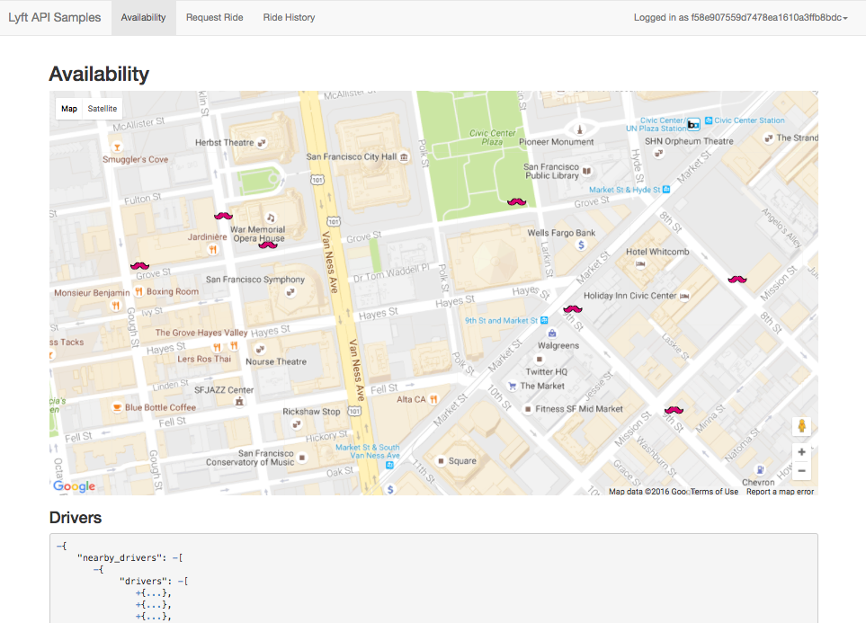

Lyft API Samples
=================

Sample Django App using Lyft Sign in (OAuth) and APIs. This is the basis for many
types of integrations, including:

- Finding available rides near a given location (optionally by ride type)
- Estimating the arrival of a Lyft ride near a given location
- Request a ride on behalf of a user
- Getting information about past rides taken by a user

As always, when developing on top of the Lyft platform, you must abide by the [Developer Agreement & Policy](https://s3.amazonaws.com/lyft-common/publicapi/production/swaggers/lyft-api-terms.pdf).

Requirements
============

To run this sample code, you'll need to install the following libraries:

- Python Social Auth (https://github.com/omab/python-social-auth)
- Python Lyft (https://github.com/bear/python-Lyft)
- south (http://south.aeracode.org/)
- Fabric (http://www.fabfile.org/)

You can install these with the following command:

    pip install -r requirements.txt

Additionally, you'll need an API key for Google Maps Javascript SDK. You can get one here:

https://developers.google.com/maps/documentation/javascript/

Getting Started
============

- Create a Lyft App (https://www.lyft.com/developers/manage)

- In the Lyft App config, ensure the Callback URL is `http://localhost:9000/complete/lyft`

- In the settings.py or settings_my.py, set the following to your own key:

    SECRET_KEY = 'YOUR_SECRET_KEY'

- Specify your Lyft API credentials in app/settings_my.py under the following section:

    SOCIAL_AUTH_LYFT_KEY = ''

    SOCIAL_AUTH_LYFT_SECRET = ''

- Specify your Google Maps Javascript key in app/settings_my.py under the following section:

    GOOGLE_MAPS_JAVASCRIPT_KEY = ''

- To initialize your database, run the from the `lyft-example` directory:

  `python manage.py makemigrations --settings=app.settings_my`

  Then run:

  `python manage.py migrate --settings=app.settings_my`

- Create an admin user for the Django admin by running the following:

  `python manage.py createsuperuser --settings=app.settings_my`

- To start the server, run the following from the `lyft-example` directory:

  `fab start`

- Open a browser and go to http://127.0.0.1:9000

Restricting Django Admin Access
--------

This code sample allows for restriction of Django admin based on IP. To enable this, do the following:

- Run the migration for this as follows:

  `python manage.py makemigrations adminrestrict --settings=app.settings_my`

  Then:

  `python manage.py migrate adminrestrict --settings=app.settings_my

- Log in as the Admin user and create a * record in the adminrestrict.allowed_ip table.

- Lastly, uncomment the following from the MIDDLEWARE_CLASSES section in settings.py:

   `adminrestrict.middleware.AdminPagesRestrictMiddleware`

Invalidate Lyft tokens
--------

For security, this code sample has a batch process to clear out Lyft auth tokens for users that either:

- Have a login of greater than 30 days ago, or
- Have never logged in and joined greater than 30 days ago

To run the process, simply execute:

	`fab invalidate'

Deploying to Heroku
============

Deploying to Heroku is even easier. The defaults in settings.py are pre-configured  to easily deploy to Heroku.

- Create a Lyft App (https://www.lyft.com/developers/manage)
- Click on the Heroku button below
- When prompted during the Heroku install, specify your:

	- SOCIAL_AUTH_LYFT_KEY
	- SOCIAL_AUTH_LYFT_SECRET

- After deploying, in the Lyft App config, ensure the Callback URL is `http://your-app-name.herokuapp.com/complete/lyft`

- To sync the database, use the Heroku CLI and run the following:

	`heroku run python manage.py migrate --app your-app-name`

- Open a browser and go to the URL specified by your deploy (http://your-app-name.herokuapp.com)

- To create an admin user, use the following Heroku CLI command:

	`heroku run python manage.py createsuperuser --username=USERNAME --email=EMAIL --app your-app-name`

Then log in via the Admin console and update your initial Lyft login user accordingly.

- Open a browser and go to the URL specified by your deploy (http://your-app-name.herokuapp.com)

Invalidating Lyft tokens on Heroku
--------

To ensure the token invalidation script works properly on Heroku, run the following from your machine: 

	`heroku run fab invalidate --app=MY_APP_NAME'
	
If this runs properly, follow the below steps to run it as a scheduled job on Heroku:

- Run `heroku addons:add scheduler:standard --app=MY_APP_NAME`
- Log into heroku.com, open your app and go to "Resources"
- Click on "Heroku Scheduler" and then "Add a New Job"
- Type in `fab invalidate`

Confirm successful execution by viewing the output in the Heroku app logs.

Notes
============
If you receive a 401 at login/Lyft it is most likely caused by a datetime discrepancy between the server making the requst and the Lyft server.

Use NTP to sync time on your server to compensate for the dift.

If you are getting this error on OSX, toggle the "set time zone" checkbox off and back on in Date & Time system preferences for a manual and temporary fix. It has been reported that OSX 10.9 Mavericks has an issue with time drift.

